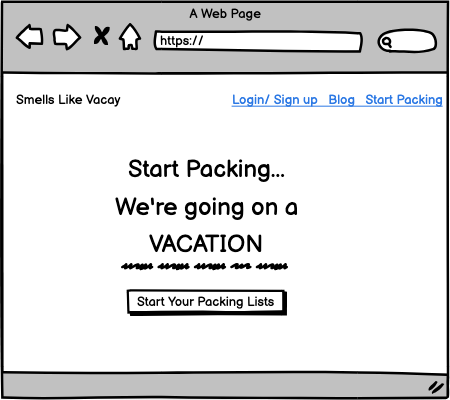

# Smells Like Vacay - Your Ultimate Vacation Packing List

  

## Project Overview

- “Smells Like Vacay” is an innovative and user-friendly packing list application designed to simplify your vacation preparations. Powered by Django, this web-based application empowers users to effortlessly create and manage their packing lists, ensuring a stress-free and well-organized travel experience.
- Are you ready to experience hassle-free vacation packing? click [here](https://start-packing-6d194f35b54b.herokuapp.com/) to open the live website and embark on your adventures with “Smells Like Vacay”!

## Table of Contents

- [Smells Like Vacay - Your Ultimate Vacation Packing List](#smells-like-vacay---your-ultimate-vacation-packing-list)
  - [Project Overview](#project-overview)
  - [Table of Contents](#table-of-contents)
  - [UX](#ux)
    - [Project Goal](#project-goal)
    - [User Stories](#user-stories)
  - [Design Choices](#design-choices)
    - [Colors](#colors)
    - [Typography](#typography)
    - [Images/Icons](#imagesicons)
    - [Responsiveness](#responsiveness)
  - [Wireframes](#wireframes)
    - [Home Page](#home-page)
    - [Packing List App](#packing-list-app)
  - [Features/Structure](#featuresstructure)
    - [Navigation](#navigation)
    - [Home Page](#home-page-1)
    - [Packing List App](#packing-list-app-1)
    - [Add Packing List](#add-packing-list)
    - [Add Task](#add-task)
    - [Edit Packing List](#edit-packing-list)
    - [Sign Up](#sign-up)
    - [Login/Logout](#loginlogout)
    - [Error 404/403/500/405](#error-404403500405)
    - [Features for Future Development](#features-for-future-development)
  - [Testing](#testing)
  - [Validation Testing](#validation-testing)
    - [HTML](#html)
    - [CSS](#css)
    - [JavaScript](#javascript)
    - [Python](#python)
    - [Automated Testing](#automated-testing)
  - [Lighthouse](#lighthouse)
      - [Desktop Results](#desktop-results)
      - [Mobile Results](#mobile-results)
  - [Manual Testing](#manual-testing)
    - [User Stories and Test Results](#user-stories-and-test-results)
    - [Known bugs](#known-bugs)
  - [Deployment](#deployment)
    - [How to Clone the Repository](#how-to-clone-the-repository)
    - [Create a new PostgreSQL database instance on ElephantSQL](#create-a-new-postgresql-database-instance-on-elephantsql)
    - [Create Application on Heroku](#create-application-on-heroku)
    - [Configure Cloudinary to host static files used by the application](#configure-cloudinary-to-host-static-files-used-by-the-application)
    - [Connect the Heroku app to the GitHub repository](#connect-the-heroku-app-to-the-github-repository)
    - [Executing automated tests](#executing-automated-tests)
    - [Final Deployment steps](#final-deployment-steps)
  - [Technologies](#technologies)
    - [Languages](#languages)
    - [Database](#database)
    - [Frameworks](#frameworks)
    - [Libraries \& Packages](#libraries--packages)
    - [Programs](#programs)
  - [Credits](#credits)
    - [Media](#media)
  - [Acknowledgements](#acknowledgements)

## UX

### Project Goal

- The goal of the packing list application is to simplify and enhance the vacation preparation process for users by providing a user-friendly and efficient platform to create, manage, and organize packing lists. The project aims to streamline the packing experience, ensuring that users can easily plan and pack for their upcoming trips with confidence and ease.

### User Stories

- For users:

  1.  As a user, I can mark a task as completed so that I can keep track of my progress while packing for my vacation.
  2.  As a user, I can edit a task in my packing list to update the details or make corrections.
  3.  As a user, I can delete a task from my packing list if I decide not to include it in my vacation planning.
  4.  As a user, I can create multiple packing lists for different types of vacations or destinations to stay organized.
  5.  As a user, I can add a new task to my packing list so that I remember to pack all the essential items for my trip.
  6.  As a user, I can toggle the completion status of a task to easily visualize which items I've already packed.
  7.  As a user, I can view the created date of each packing list to keep track of when I planned for my vacations.
  8.  As a user, I can view the created date of each task to see when I added it to my packing list.
  9.  As a user, I can edit the title of my packing list to give it a specific name related to my vacation plans.
  10. As a user, I can view all my packing lists and tasks in a single page for a comprehensive overview of my vacation preparations.
  11. As a user, I can log in to my account to access my private packing lists and tasks securely.
  12. As a user, I can sign up for a new account to start using the “Smells Like Vacay” packing list application.
  13. As a user, I can log out of my account to ensure my packing lists are private and secure.

- For admin :

  14. As an admin, I can access a dashboard to manage all users packing lists and tasks for administrative purposes.
  15. As an admin, I can view and edit any packing list or task in the system for administrative oversight.
  16. As an admin, I can delete any packing list or task if necessary, ensuring data accuracy and relevance.

## Design Choices

### Colors

The color palette for the Smells Like Vacay project is carefully chosen to evoke a sense of vacation, adventure, and serenity. The primary colors used throughout the project are:

- **Coconut Brown (#cd8253)**: This warm brown color is used for main headings and essential elements, providing a comforting and welcoming feel to the website.

- **Turquoise (#20a8b7)**: The vibrant turquoise color is used for lead text, task headings, and other accent elements, adding a touch of excitement and playfulness.

- **Dark Gray (#4c4c4c)**: The dark gray color is used for regular paragraphs, maintaining readability and complementing the other color choices.

- **Soft Green (#7ebdaf)**: This soft green hue is used for primary buttons, offering a refreshing contrast to the background and invoking a feeling of nature.

### Typography

The font choices for the Smells Like Vacay project contribute to its overall aesthetic, ensuring a harmonious and legible reading experience. The selected fonts are:

- **Poppins**: This font is used for main headings (h1) throughout the project, creating a bold and stylish look that captures attention.

- **Roboto**: For regular paragraphs and essential texts, 'Roboto' is utilized to provide clarity and simplicity, enhancing readability.

### Images/Icons

The project uses captivating images and icons to enhance the user experience and align with the vacation theme:

- **Background Image**: The index page features a captivating beach image as the background, transporting users to a relaxing vacation setting.

- **Font Awesome Icons**: The project incorporates Font Awesome icons to add visual appeal and improve user interaction, like the beach umbrella icon in the navigation bar.

### Responsiveness

To ensure that users can access and use the app seamlessly across various devices, the project follows responsive design principles:

- **Viewport Settings**: The `<meta name="viewport">` tag is set to control the page's scaling and responsiveness, making it mobile-friendly.

- **Bootstrap Grid**: The Bootstrap grid system is utilized to create responsive layouts and adapt content to different screen sizes.

## Wireframes

### Home Page

### Packing List App

## Features/Structure

### Navigation

- The navigation bar provides easy access to different sections of the website, such as the home page and the packing list app.
- Users can quickly navigate to the "Packing List App", "Home", "Login", "Logout" and "Sign up" pages directly from the navigation bar.
- The navigation bar adjusts responsively for different screen sizes, ensuring a seamless user experience on various devices.

### Home Page

- The home page greets users with an inviting message and call-to-action button to start packing for their future vacation.
- Users can find a user-friendly interface with clear headings and lead text, making it easy to understand the purpose of the application.

### Packing List App

- The "Packing List App" page presents users with their existing packing lists and tasks in an organized manner.
- Each packing list is displayed with its creation date, providing users with a clear overview of their lists.
- Users can toggle the completion status of tasks, helping them track their progress efficiently.

### Add Packing List

- Users can add new packing lists through the "Add Packing List" page.
- The form allows users to input the list's title enhancing list organization.

### Add Task

- The "Add Task" page enables users to add new tasks to a specific packing list.
- Users can change the completion status of tasks.
- Users can select the packing list to associate the task with, providing context and structure to the tasks.

### Edit Packing List

- Users can edit the details of existing packing lists.
- Additionally, users can manage the tasks associated with each packing list through an editable formset.

### Sign Up

- The "Sign Up" page allows new users to create an account, granting them access to additional features such as private checklists and task management.

### Login/Logout

- The "Login" page enables registered users to log in and access their personalized packing lists.
- Users can easily log out from the navigation bar, securing their account information.

### Error 404/403/500/405

- The application includes custom error pages for various HTTP status codes (404, 403, 500, 405).
- Users will be presented with informative and user-friendly error pages in case they encounter any issues.

By incorporating these features and organizing the website with clear navigation and user-friendly interfaces, Smells Like Vacay becomes a reliable and efficient packing list application for users to manage their vacation preparations effortlessly.

### Features for Future Development

For future improvements, I plan to implement the following features:

1. **Blog App**: I aim to add a blog application where users can access valuable tips and tricks for creating efficient packing lists, ensuring a smoother and more organized travel experience.

2. **Enhanced User Experience**: I plan to optimize the user experience by allowing the forms for adding and editing tasks to appear directly on the packing list app. This improvement will eliminate the need for redirection to another page, making the process more seamless.

3. **Checkbox for Tasks**: Instead of using a toggle button, I will introduce checkboxes for tasks. This change will provide users with a more intuitive and visually appealing way to mark tasks as completed or incomplete.

By incorporating these features, I aim to enhance the overall usability and convenience of the Smells Like Vacay packing list application, making it an even more valuable tool for travelers to stay organized and well-prepared for their vacations.

## Testing

## Validation Testing

### HTML

[W3C](https://validator.w3.org/) was used to validate the HTML on all pages of the site. It was also used to validate the CSS. As the site is created with Django and utilises Django templating language within the HTML, I have checked the HTML by inspecting the page source and then running this through the validator. You can click each page to see the corresponding screenshot evidence.

| Page                                                            | Result |
| :-------------------------------------------------------------- | :----- |
| [Home Page](images-for-readme/w3c-homepage.png)                 | Pass   |
| [Packing List App](images-for-readme/w3c-packinglist-app.png)   | Pass   |
| [Add Packing List](images-for-readme/w3c-add-list.png)          | Pass   |
| [Add Task](images-for-readme/w3c-add-task.png)                  | Pass   |
| [Edit Packing List](images-for-readme/w3c-edit-packinglist.png) | Pass   |
| [Login](images-for-readme/w3c-login.png)                        | Pass   |
| [Logout](images-for-readme/w3c-logout.png)                      | Pass   |
| [Sign up](images-for-readme/w3c-signup.png)                     | Pass   |
| [Error 404](images-for-readme/w3c-error404.png)                 | Pass   |

### CSS

[W3C](https://jigsaw.w3.org/css-validator/#validate_by_input) was used to validate the CSS.

| File                                                  | Result |
| :---------------------------------------------------- | :----- |
| [static/css/style.css](images-for-readme/w3c-css.png) | Pass   |

### JavaScript

[JS Hint](https://jshint.com/) was used to validate the JavaScript.

| File                                                        | Result |
| :---------------------------------------------------------- | :----- |
| [static/js/script.js](images-for-readme/jshint-test-js.png) | Pass   |

### Python

[Code Institute Python Linter](https://pep8ci.herokuapp.com/) was used to validate the python code.

| File                                                          | Result |
| :------------------------------------------------------------ | :----- |
| **Start-Packing**                                             |
| [stearpacking/urls.py](images-for-readme/pep8-urls.py.png)    | Pass   |
| **Packing List App**                                          |
| [packinglist/views.py](images-for-readme/pep8-views.py.png)   | Pass   |
| [packinglist/models.py](images-for-readme/pep8-models.py.png) | Pass   |
| [packinglist/forms.py](images-for-readme/pep8-forms.py.png)   | Pass   |
| [packinglist/admin.py](images-for-readme/pep8-admin.py.png)   | Pass   |

### Automated Testing

- [Django testing tools](https://docs.djangoproject.com/en/3.2/topics/testing/tools/) and Django TestCase was used to create automatic tests for Python files. A total of 25 tests were written for the following files:

  - [forms.py](https://github.com/TeodoraAlina/start-packing/blob/main/packinglist/forms.py) test file: [test_forms.py](https://github.com/TeodoraAlina/start-packing/blob/main/packinglist/test_forms.py)
  - [models.py](https://github.com/TeodoraAlina/start-packing/blob/main/packinglist/models.py) test file: [test_models.py](https://github.com/TeodoraAlina/start-packing/blob/main/packinglist/test_models.py)
  - [views.py](https://github.com/TeodoraAlina/start-packing/blob/main/packinglist/views.py) test file: [test_views.py](https://github.com/TeodoraAlina/start-packing/blob/main/packinglist/test_views.py)

- The Django's test reporting tool '[Coverage](https://coverage.readthedocs.io/en/7.2.7/)' was installed to show the percentage of Python code that's been covered by tests:
  

## Lighthouse

#### Desktop Results

[Home Page](images-for-readme/lighthouse-homepage-desktop.png)
[Packing List App](images-for-readme/lighthouse-packinglist-app-desktop.png)

- Desktop performed well on all major pages of the site with minimal improvements needed.

#### Mobile Results

[Home Page](images-for-readme/lighthouse-homepage-mobile.png)
[Packing List App](images-for-readme/lighthouse-packinglist-app-mobile.png)

## Manual Testing

### User Stories and Test Results

| User Story                                                                                                                          | Test                                                         | Result |
| ----------------------------------------------------------------------------------------------------------------------------------- | ------------------------------------------------------------ | ------ |
| 1. As a user, I can mark a task as completed so that I can keep track of my progress while packing for my vacation.                 | Create a task and mark it as completed.                      | Pass   |
| 2. As a user, I can edit a task in my packing list to update the details or make corrections.                                       | Create a task, edit its details, and save the changes.       | Pass   |
| 3. As a user, I can delete a task from my packing list if I decide not to include it in my vacation planning.                       | Create a task, then delete it from the list.                 | Pass   |
| 4. As a user, I can create multiple packing lists for different types of vacations or destinations to stay organized.               | Create multiple packing lists with different titles.         | Pass   |
| 5. As a user, I can add a new task to my packing list so that I remember to pack all the essential items for my trip.               | Add a new task to the packing list.                          | Pass   |
| 6. As a user, I can toggle the completion status of a task to easily visualize which items I’ve already packed.                     | Create a task and toggle its completion status.              | Pass   |
| 7. As a user, I can view the created date of each packing list to keep track of when I planned for my vacations.                    | Create a packing list and check its created date.            | Pass   |
| 8. As a user, I can view the created date of each task to see when I added it to my packing list.                                   | Create a task and check its created date.                    | Pass   |
| 9. As a user, I can edit the title of my packing list to give it a specific name related to my vacation plans.                      | Create a packing list, edit its title, and save changes.     | Pass   |
| 10. As a user, I can view all my packing lists and tasks on a single page for a comprehensive overview of my vacation preparations. | Access the packing list page and verify all lists and tasks. | Pass   |
| 11. As a user, I can log in to my account to access my private packing lists and tasks securely.                                    | Log in with valid credentials and access private lists.      | Pass   |
| 12. As a user, I can sign up for a new account to start using the “Smells Like Vacay” packing list application.                     | Sign up with a new account and access the app's features.    | Pass   |
| 13. As a user, I can log out of my account to ensure my packing lists are private and secure.                                       | Log out from the account and verify successful logout.       | Pass   |
| 14. As an admin, I can access a dashboard to manage all users’ packing lists and tasks for administrative purposes.                 | Access the admin dashboard and verify access to all data.    | Pass   |
| 15. As an admin, I can view and edit any packing list or task in the system for administrative oversight.                           | Access the admin dashboard, view and edit data for users.    | Pass   |
| 16. As an admin, I can delete any packing list or task if necessary, ensuring data accuracy and relevance.                          | Access the admin dashboard, delete data for users.           | Pass   |

### Known bugs

- Currently no known bugs.

## Deployment

Detailed below are instructions on how to clone this project repository and the steps to configure and deploy the application. Code Institute also provides a summary of similar process steps here : [CI Cheat Sheet](https://codeinstitute.s3.amazonaws.com/fst/Django%20Blog%20Cheat%20Sheet%20v1.pdf)

1.  How to Clone the Repository
2.  Create a new PostgreSQL database instance on ElephantSQL
3.  Create Application on Heroku
4.  Configure Cloudinary to host images used by the application
5.  Connect the Heroku app to the GitHub repository
6.  Executing automated tests
7.  Final Deployment steps

### How to Clone the Repository

- Go to the [https://github.com/TeodoraAlina/start-packing](https://github.com/TeodoraAlina/start-packing) repository on GitHub
- Click the "Code" button to the right of the screen, click HTTPs and copy the link there
- Open a GitBash terminal and navigate to the directory where you want to locate the clone
- On the command line, type "git clone" then paste in the copied url and press the Enter key to begin the clone process
- To install the packages required by the application use the command : pip install -r requirements.txt
- When developing and running the application locally set DEBUG=True in the settings.py file
- Changes made to the local clone can be pushed back to the repository using the following commands :
  - git add _filenames_ (or "." to add all changed files)
  - git commit -m _"text message describing changes"_
  - git push
- N.B. Any changes pushed to the master branch will take effect on the live project once the application is re-deployed from Heroku

### Create a new PostgreSQL database instance on ElephantSQL

- Log in to [ElephantSQL.com](https://www.elephantsql.com/) to access your dashboard
- Click “Create New Instance”
- Set up your plan
- Give your plan a Name (this is commonly the name of the project)
  - Select the Tiny Turtle (Free) plan
  - You can leave the Tags field blank
- Select “Select Region”
- Select a data center near you
  - If you receive a message saying "Error: No cluster available in your-chosen-data-center yet", choose another region. Note: You're free to use any of the available free data centers, be it AWS, Azure or any of the other providers.
- Then click “Review”
- Check your details are correct and then click “Create instance”
- Return to the ElephantSQL dashboard and click on the database instance name for this project
- In the URL section, click the copy icon to copy the database URL

### Create Application on Heroku

- Log in to Heroku at [https://heroku.com](https://heroku.com/) - create an account if needed.
- From the Heroku dashboard, click the Create new app button. For a new account an icon will be visible on screen to allow you to Create an app, otherwise a link to this function is located under the New dropdown menu at the top right of the screen.
- On the Create New App page, enter a unique name for the application and select region. Then click Create app.
- Next, click on Settings on the Application Configuration page and click on the "Reveal Config Vars" button - add the url from ElephantSQL to DATABASE_URL
- Add a new Config Var called DISABLE_COLLECTSTATIC and assign it a value of 1.
- Add a new Config Var called SECRET_KEY and assign it a value - any random string of letters, digits and symbols.
- The settings.py file should be updated to use the DATABASE_URL and SECRET_KEY environment variable values as follows :
  - DATABASES = {'default': dj_database_url.parse(os.environ.get('DATABASE_URL'))}
  - SECRET_KEY = os.environ.get('SECRET_KEY')
- In Gitpod, in the project terminal window, to initialize the data model in the postgres database, run the command : python3 manage.py migrate
- Make sure the project requirements.txt file is up to date with all necessary supporting files by entering the command : pip3 freeze --local > requirements.txt
- Commit and push any local changes to GitHub.
- In order to be able to run the application on localhost, add SECRECT_KEY and DATABASE_URL and their values to env.py

### Configure Cloudinary to host static files used by the application

- Log in to Cloudinary - create an account if needed. To create the account provide your name, email and set up a password. For "primary interest" you can choose "Programmable Media for image and video API". Click "Create Account" and you will be sent an email to verify your account and bring you to the dashboard.
- From the dashboard, copy the "API Environment variable" value by clicking on the "Copy to clipboard" link.
- Log in to Heroku and go to the Application Configuration page for the application. Click on Settings and click on the "Reveal Config Vars" button.
- Add a new Config Var called CLOUDINARY_URL and assign it the value copied from the Cloudinary dashboard, but remove the "CLOUDINARY_URL=" at the beginning of the string.
- In order to be able to run the application on localhost, also add the CLOUDINARY_URL environment variable and value to env.py

### Connect the Heroku app to the GitHub repository

- Go to the Application Configuration page for the application on Heroku and click on the Deploy tab.
- Select GitHub as the Deployment Method and if prompted, confirm that you want to connect to GitHub. Enter the name of the github repository and click on Connect to link up the Heroku app to the GitHub repository code.
- Scroll down the page and choose to either Automatically Deploy each time changes are pushed to GitHub, or Manually deploy - for this project Manual Deploy was selected.
- The application can be run from the Application Configuration page by clicking on the Open App button.

### Executing automated tests

- The existing automated jquery/javascript test can be executed using jest as follows :
  - If jest is not installed then run the command : npm install --save-dev jest
  - Run the js test file using the command : npm test
- The existing automated django/python tests are executed using unittest as follows :
  - Run the python tests using the command : python3 manage.py test
  - To run just a subset of the tests, then append the application and test file name to the command, e.g. : python3 manage.py test booking.test_models
- Test coverage for the django/python tests can be reviewed using the coverage tool :
  - If coverage is not installed then run the command : pip3 install coverage
  - Execute the following series of commands to determine test coverage :
    - coverage run --source=booking manage.py test
    - coverage report

### Final Deployment steps

Once code changes have been completed and tested on localhost, the application can be prepared for Heroku deployment as follows :

- Set DEBUG flag to False in settings.py
- Ensure this line exists in settings.py to make summernote work on the deployed environment (CORS security feature): X_FRAME_OPTIONS = 'SAMEORIGIN'
- Ensure requirements.txt is up to date using the command : pip3 freeze --local > requirements.txt
- Push files to GitHub
- In the Heroku Config Vars for the application delete this environment variable : DISABLE_COLLECTSTATIC
- On the Heroku dashboard go to the Deploy tab for the application and click on deploy branch

## Technologies

### Languages

- HTML, CSS, JavaScript, Python

### Database

- sqlite3, ElephantSQL

### Frameworks

- Django
- Bootstrap

### Libraries & Packages

- Font Awesome
- Django allauth
- Django Crispy Forms
- gunicorn
- psycopg2
- SweetAlert2
- Google Fonts

### Programs

- Codeanywhere
- GitHub
- Favicon.io
- Balsamiq
- Cloudinary
- Heroku

## Credits

- The Code Institute 'I Think, Therefore I Blog' walkthrough project assisted and guided in the setup and basic structure of this project.
- Code Institute Student Template: [codeanywhere full template](https://github.com/Code-Institute-Org/ci-full-template).
- Documentation on [Django Formset](https://docs.djangoproject.com/en/4.2/topics/forms/formsets/)

### Media

- The color pallete was taken from [Coolors]([https://coolors.co/palettes/popular/cd8253).
- The background-images images were chosen from [Pexels](https://www.pexels.com)
- The icons for the favicon and navigation bar were taken from [Font Awesome](https://fontawesome.com/).
- The favicon image was converted using [Favicon.io](https://favicon.io/).

## Acknowledgements

- My mentor, for continuous helpful feedback and support throughout the project.
- The tutors at Code Institute, for their patience and support.
- The Code Institute Slack community, for tips and guidance.

[Back to the beginning](#table-of-contents)
